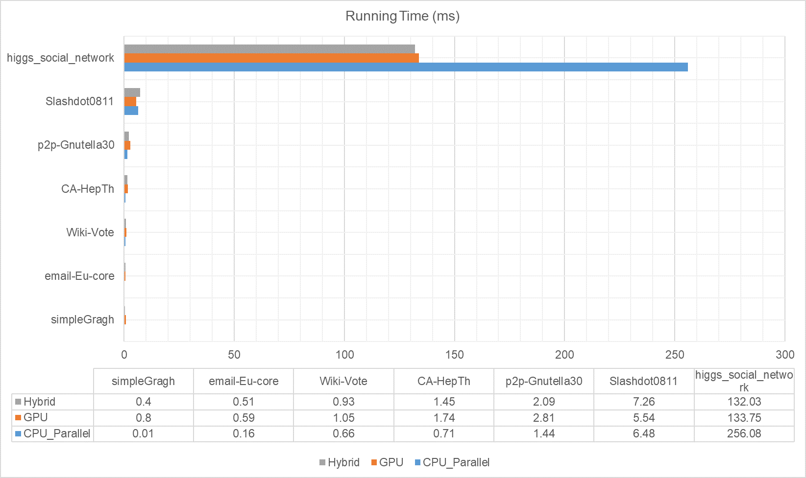
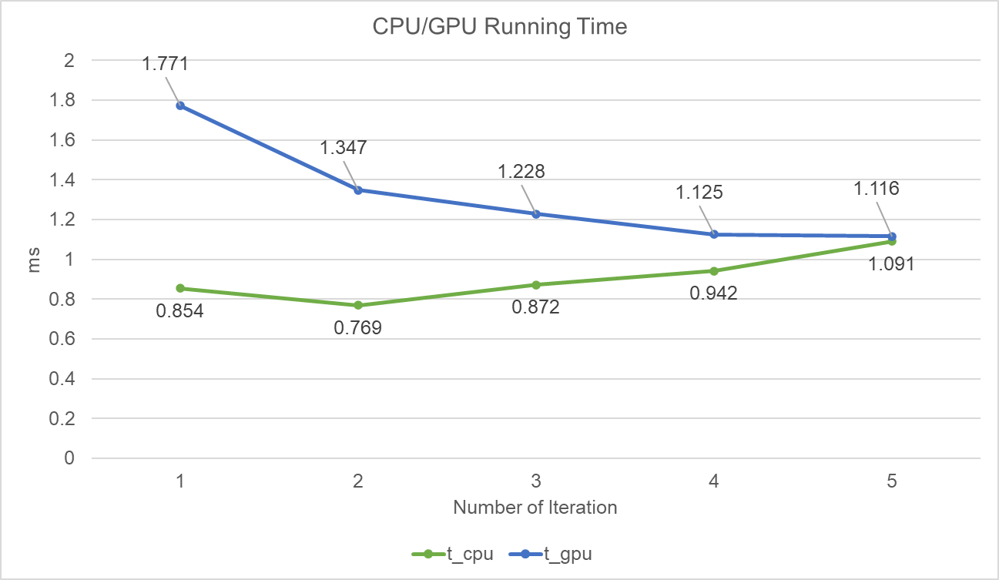

# SSSP_On_CUDA

---

Implement Single-Source Shortest Paths (SSSP) on CPU, GPU (CUDA), and Hybrid (CPU-GPU)

---

<!-- TOC -->

- [SSSP_On_CUDA](#sssponcuda)
  - [Instruction](#instruction)
  - [Description](#description)
    - [Implementation on CPU](#implementation-on-cpu)
    - [Implementation on GPU](#implementation-on-gpu)
    - [Implementation on Hybrid (CPU - GPU)](#implementation-on-hybrid-cpu---gpu)
      - [Load Balancing of Hybird Implementation](#load-balancing-of-hybird-implementation)
  - [Running Application](#running-application)
      - [Application Argument](#application-argument)
  - [Input Graph Format](#input-graph-format)
  - [Performance](#performance)
    - [Datasets](#datasets)
    - [Running Time on graph datasets](#running-time-on-graph-datasets)
  - [Known issues](#known-issues)
  - [To-Do](#to-do)

<!-- /TOC -->

## Instruction

**Note:** Before run `make`, if **in Linux** please modify the `OPENMPFLAGS=-Xcompiler -openmp` to `OPENMPFLAGS=-Xcompiler -fopenmp` in `Makefile`. **In Windows**, no need to make modification.

Run `make` in the root folder to generate the executable file.

The core algorithm of this project is **Bellman-Ford Algorithm**.

## Description

### Implementation on CPU

1. Loop all edges to update vertexs' distance to source node.
2. Repeate *Step 1* until there is no vertex needs to update its distance to source.

### Implementation on GPU

1. Divide all edges into multiple parts.
2. Launch multiple threads to process the edges assigned from *Step 1*.
3. Repeate *Step 1* and *Step 2* until there is no vertex needs to update its distance to source.
Basic implementation of dijkstra algorithm on GPU.
4. Use compiled file `sssp` to run the GPU's implementation.

### Implementation on Hybrid (CPU - GPU)

1. The edges are split into two parts and assigned to CPU and GPU separately.
2. CPU will use OpenMP to launch multiple threads to process the edges.
3. Using CUDA to launch GPU threads to process edges.
4. After each iteration, copy the **dist** array back to host then use OpenMP to launch threads to merge the dist of CPU's and GPU's.
5. Use compiled file `openmp` to run the hybrid's implementation.

#### Load Balancing of Hybird Implementation

To better utilize the computing resource of CPU and GPU. The splitRatio  is very important. I use a simple formula to dynamically change the splitRatio.


-  time to process edges in CPU
- time to process edges in GPU


## Running Application

```shell
$ ./sssp --input path_of_graph
$ ./openmp --input path_of_graph 
```

for `openmp` it will run hybrid implementation and GPU-only's implementation. You also can specify argument *--oncpu true* to run a CPU-only parallel implementation (OpenMP).


#### Application Argument

```
Optional arguments:
  [--oncpu]: Run this graph on CPU. Its value must be true/false (default: false). E.g., --oncpu true
  [--source]: Set the source node (default: minimum node number). E.g., --source 0  
```

## Input Graph Format

Input graphs should be in form of plain text files. The format of each edge is as following:

```
source end weight
```

if the weight is not specified, it will be assigned to a default value: **1**.


## Performance 

### Datasets 

| Datasets  | Nodes | Edges | Diameter |
| --                    | --:       | --:         | --: |
| simpleGraph           | 9         | 11          | 4   | 
| email-Eu-core         | 1,005     | 25,571      | 7   |
| Wiki-Vote             | 8,298     | 103,689     | 7   |
| CA-HepTh              | 9,877     | 25,998      | 17  |
| p2p-Gnutella30        | 36,682    | 88,328      | 10  |
| Slashdot0811          | 77,350    | 516,575     | 11  |
| higgs_social_network  | 456,626   | 14,855,842  | 9   |
| roadNet-PA            | 1,088,092 | 1,541,898   | 786 |

### Running Time on graph datasets

**Experiment Platform**

- CPU: i7-4720HQ (4 cores with 8 threads)
- Memory: 16 GB DDR3 1600MHz
- GPU: GTX965M with 2 GB Memory




**How load balancing works in hybrid**



---

## Known issues

- [x] Improve the speed of loading graph
- [x] Setting size of message -- Size is not correct


---

## To-Do

- [ ] bottleneck: data transferring between host and device
- [ ] apporach the ideal split ratio faster


--- 

LaTeX used in markdown


$(\frac{size\;of\;CPU\;data}{size\;of\;whole\;data})$

$t_{cpu}:$

$t_{gpu}:$

$$factor=\frac{t_{cpu}}{t_{gpu}}$$

$$splitRatio = \begin{cases}splitRatio + 0.05, & \text {if factor < 0.9} \\ splitRatio - 0.05, & \text {if factor > 1.1} \end{cases}$$